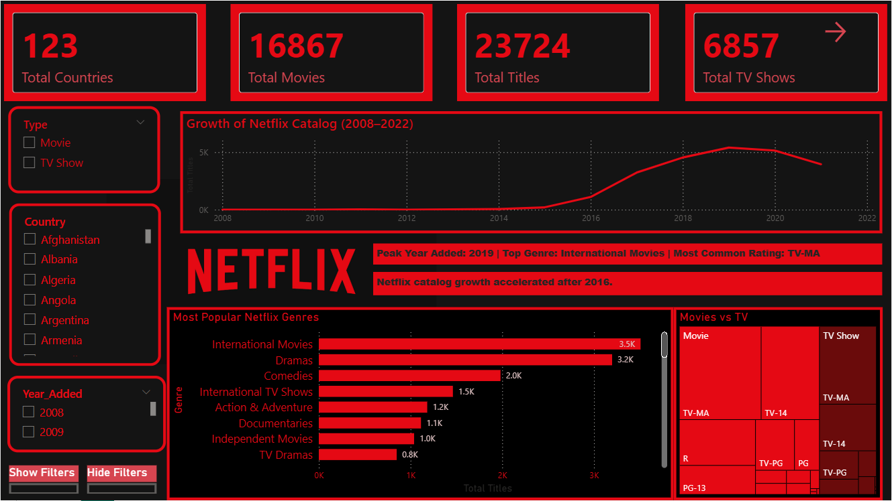

# 📊 Netflix Data Analysis Dashboard – Power BI

## 📌 Project Overview

This project presents an interactive **Power BI dashboard** built to analyze Netflix’s global content catalog.
The dashboard provides insights into content distribution, growth trends, genres, ratings, and country-wise availability.

The goal of this project is to demonstrate **data analysis, visualization, and business insight generation** using real-world data.

## 🎯 Objectives

* Analyze Netflix content growth over time
* Identify the most popular genres and content types
* Understand rating distribution across movies and TV shows
* Explore country-wise content availability
* Build an interactive dashboard for dynamic filtering and insights

## 📸 Dashboard Preview

## 📊 Key Insights

* 📈 Peak Year: 2019 had the highest number of content additions
* 🌍 Global Reach: Content spans across 120+ countries
* 🎬 Top Genre: International Movies dominate the catalog
* 📺 Content Type: Movies significantly outnumber TV Shows
* 🔞 Most Common Rating: TV-MA (mature audience content)
* 🚀 Growth Trend: Rapid expansion observed after 2016

## 🛠️ Tools & Technologies Used

* Power BI – Dashboard creation and visualization
* Power Query – Data cleaning and transformation
* DAX (Data Analysis Expressions) – Calculated measures and KPIs
* Dataset (CSV) – Netflix dataset from Kaggle

## ⚙️ Features of Dashboard

* Interactive filters:

  * Content Type (Movie / TV Show)
  * Country
  * Year Added
* KPI Cards:

  * Total Titles
  * Total Movies
  * Total TV Shows
  * Total Countries
 

* Visualizations:

  * 📈 Line chart for growth trends (2008–2022)
  * 📊 Bar chart for genre distribution
  * 🌳 Treemap for rating comparison (Movies vs TV Shows)
  * Dynamic and user-friendly UI design

## 🔄 Data Processing Steps

1. Imported raw dataset into Power BI
2. Cleaned missing and inconsistent values using Power Query
3. Transformed data types and created structured columns
4. Created calculated columns and measures using DAX
5. Built interactive visuals and applied filters

## ⚙️ Tools Used
- Power BI
- Power Query
- DAX

## 📁 Files
- (NETFLIX DASHBOARD.pbix)
- (netflix_titles.csv)
